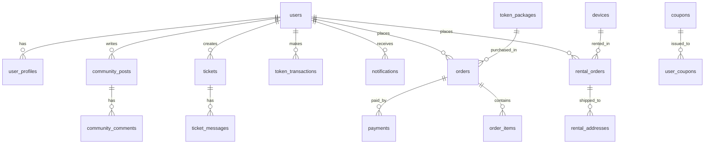

# AI 租易用 - 数据库模型设计文档

**版本：** V1.0  
**创建时间：** 2026-04-10  
**设计者：** 大内总管·王德发

---

## 📋 核心业务模块

```
┌─────────────────────────────────────────────────────────────┐
│                      AI 租易用系统架构                        │
├─────────────────────────────────────────────────────────────┤
│  用户中心  │  设备租赁  │  Token 工厂  │  订单支付  │  社区  │
│  工单系统  │  消息通知  │  分销系统  │  优惠券   │  发票  │
└─────────────────────────────────────────────────────────────┘
```

---

## 🗄️ 数据表设计

### 1️⃣ 用户模块 (User)

#### `users` - 用户基础表
| 字段 | 类型 | 说明 | 约束 |
|------|------|------|------|
| id | BIGINT | 用户 ID | PRIMARY KEY, AUTO_INCREMENT |
| phone | VARCHAR(11) | 手机号 | UNIQUE, NOT NULL, INDEX |
| nickname | VARCHAR(50) | 昵称 | |
| avatar | VARCHAR(255) | 头像 URL | |
| gender | TINYINT | 性别 (0:未知 1:男 2:女) | DEFAULT 0 |
| user_type | TINYINT | 用户类型 (1:个人 2:企业) | DEFAULT 1 |
| status | TINYINT | 状态 (0:禁用 1:正常) | DEFAULT 1 |
| created_at | DATETIME | 创建时间 | NOT NULL |
| updated_at | DATETIME | 更新时间 | NOT NULL |

#### `user_profiles` - 用户详情表
| 字段 | 类型 | 说明 | 约束 |
|------|------|------|------|
| id | BIGINT | ID | PRIMARY KEY |
| user_id | BIGINT | 用户 ID | UNIQUE KEY, FOREIGN KEY |
| email | VARCHAR(100) | 邮箱 | |
| real_name | VARCHAR(50) | 真实姓名 | |
| id_card | VARCHAR(18) | 身份证号 | 加密存储 |
| company_name | VARCHAR(100) | 企业名称 | |
| company_license | VARCHAR(255) | 营业执照 URL | |
| certification_status | TINYINT | 认证状态 (0:未认证 1:审核中 2:已认证) | DEFAULT 0 |

#### `user_auth_logs` - 登录日志表
| 字段 | 类型 | 说明 | 约束 |
|------|------|------|------|
| id | BIGINT | ID | PRIMARY KEY |
| user_id | BIGINT | 用户 ID | INDEX |
| login_type | TINYINT | 登录方式 (1:验证码 2:密码) | |
| ip_address | VARCHAR(45) | IP 地址 | |
| user_agent | VARCHAR(500) | 设备信息 | |
| login_at | DATETIME | 登录时间 | INDEX |

---

### 2️⃣ 设备租赁模块 (Device Rental)

#### `devices` - 设备库表
| 字段 | 类型 | 说明 | 约束 |
|------|------|------|------|
| id | BIGINT | 设备 ID | PRIMARY KEY |
| name | VARCHAR(100) | 设备名称 | NOT NULL |
| category | VARCHAR(50) | 分类 (工作站/开发板/机器人/边缘设备) | INDEX |
| brand | VARCHAR(50) | 品牌 | |
| model | VARCHAR(100) | 型号 | |
| specs | JSON | 规格参数 | |
| image_urls | JSON | 图片 URL 数组 | |
| daily_price | DECIMAL(10,2) | 日租价格 | NOT NULL |
| weekly_price | DECIMAL(10,2) | 周租价格 | |
| monthly_price | DECIMAL(10,2) | 月租价格 | |
| deposit | DECIMAL(10,2) | 押金 | NOT NULL |
| stock_total | INT | 总库存 | DEFAULT 0 |
| stock_available | INT | 可用库存 | DEFAULT 0 |
| status | TINYINT | 状态 (0:下架 1:上架) | DEFAULT 1 |
| is_hot | BOOLEAN | 是否热门 | DEFAULT FALSE |
| created_at | DATETIME | 创建时间 | |

#### `rental_orders` - 租赁订单表
| 字段 | 类型 | 说明 | 约束 |
|------|------|------|------|
| id | BIGINT | 订单 ID | PRIMARY KEY |
| order_no | VARCHAR(32) | 订单编号 | UNIQUE, INDEX |
| user_id | BIGINT | 用户 ID | INDEX |
| device_id | BIGINT | 设备 ID | FOREIGN KEY |
| rental_type | TINYINT | 租期类型 (1:日租 2:周租 3:月租) | |
| rental_days | INT | 租赁天数 | |
| unit_price | DECIMAL(10,2) | 单价 | |
| total_amount | DECIMAL(10,2) | 订单总额 | |
| deposit_amount | DECIMAL(10,2) | 押金金额 | |
| start_date | DATE | 起租日期 | |
| end_date | DATE | 结束日期 | |
| status | TINYINT | 状态 (0:待支付 1:待发货 2:租赁中 3:待归还 4:已完成 5:已取消) | INDEX |
| paid_at | DATETIME | 支付时间 | |
| shipped_at | DATETIME | 发货时间 | |
| received_at | DATETIME | 签收时间 | |
| returned_at | DATETIME | 归还时间 | |
| created_at | DATETIME | 创建时间 | |

#### `rental_addresses` - 租赁地址表
| 字段 | 类型 | 说明 | 约束 |
|------|------|------|------|
| id | BIGINT | ID | PRIMARY KEY |
| rental_order_id | BIGINT | 租赁订单 ID | FOREIGN KEY |
| receiver_name | VARCHAR(50) | 收货人 | |
| receiver_phone | VARCHAR(20) | 收货手机 | |
| province | VARCHAR(50) | 省 | |
| city | VARCHAR(50) | 市 | |
| district | VARCHAR(50) | 区 | |
| detail_address | VARCHAR(255) | 详细地址 | |
| express_company | VARCHAR(50) | 快递公司 | |
| express_no | VARCHAR(50) | 快递单号 | |

---

### 3️⃣ Token 模块 (Token Management)

#### `token_packages` - Token 套餐表
| 字段 | 类型 | 说明 | 约束 |
|------|------|------|------|
| id | BIGINT | 套餐 ID | PRIMARY KEY |
| name | VARCHAR(50) | 套餐名称 | NOT NULL |
| token_amount | BIGINT | Token 数量 | NOT NULL |
| price | DECIMAL(10,2) | 价格 | NOT NULL |
| validity_days | INT | 有效期 (天) | |
| is_popular | BOOLEAN | 是否推荐 | DEFAULT FALSE |
| status | TINYINT | 状态 (0:下架 1:上架) | DEFAULT 1 |

#### `user_token_wallets` - 用户 Token 钱包表
| 字段 | 类型 | 说明 | 约束 |
|------|------|------|------|
| id | BIGINT | ID | PRIMARY KEY |
| user_id | BIGINT | 用户 ID | UNIQUE KEY |
| balance | BIGINT | 可用余额 | DEFAULT 0 |
| frozen | BIGINT | 冻结金额 | DEFAULT 0 |
| total_recharged | BIGINT | 累计充值 | DEFAULT 0 |
| total_consumed | BIGINT | 累计消费 | DEFAULT 0 |
| updated_at | DATETIME | 更新时间 | |

#### `token_transactions` - Token 流水表
| 字段 | 类型 | 说明 | 约束 |
|------|------|------|------|
| id | BIGINT | ID | PRIMARY KEY |
| user_id | BIGINT | 用户 ID | INDEX |
| type | TINYINT | 类型 (1:充值 2:消费 3:退款 4:赠送) | INDEX |
| amount | BIGINT | 变动金额 | |
| balance_after | BIGINT | 变动后余额 | |
| related_order_no | VARCHAR(32) | 关联订单号 | |
| description | VARCHAR(255) | 说明 | |
| created_at | DATETIME | 创建时间 | INDEX |

---

### 4️⃣ 订单支付模块 (Order & Payment)

#### `orders` - 综合订单表
| 字段 | 类型 | 说明 | 约束 |
|------|------|------|------|
| id | BIGINT | 订单 ID | PRIMARY KEY |
| order_no | VARCHAR(32) | 订单编号 | UNIQUE, INDEX |
| user_id | BIGINT | 用户 ID | INDEX |
| order_type | TINYINT | 订单类型 (1:设备租赁 2:Token 充值 3:技术服务) | |
| total_amount | DECIMAL(10,2) | 订单总额 | |
| discount_amount | DECIMAL(10,2) | 优惠金额 | DEFAULT 0 |
| payable_amount | DECIMAL(10,2) | 实付金额 | |
| status | TINYINT | 状态 (0:待支付 1:已支付 2:已完成 3:已取消 4:退款中 5:已退款) | INDEX |
| payment_method | TINYINT | 支付方式 (1:微信 2:支付宝 3:银行卡) | |
| paid_at | DATETIME | 支付时间 | |
| remark | VARCHAR(500) | 备注 | |
| created_at | DATETIME | 创建时间 | |
| updated_at | DATETIME | 更新时间 | |

#### `order_items` - 订单明细表
| 字段 | 类型 | 说明 | 约束 |
|------|------|------|------|
| id | BIGINT | ID | PRIMARY KEY |
| order_id | BIGINT | 订单 ID | FOREIGN KEY, INDEX |
| product_type | VARCHAR(50) | 商品类型 (device/token/service) | |
| product_id | BIGINT | 商品 ID | |
| product_name | VARCHAR(100) | 商品名称 | |
| quantity | INT | 数量 | DEFAULT 1 |
| unit_price | DECIMAL(10,2) | 单价 | |
| subtotal | DECIMAL(10,2) | 小计 | |

#### `payments` - 支付记录表
| 字段 | 类型 | 说明 | 约束 |
|------|------|------|------|
| id | BIGINT | ID | PRIMARY KEY |
| order_no | VARCHAR(32) | 订单编号 | UNIQUE KEY, INDEX |
| payment_no | VARCHAR(64) | 支付流水号 (第三方) | |
| payment_method | TINYINT | 支付方式 | |
| amount | DECIMAL(10,2) | 支付金额 | |
| status | TINYINT | 状态 (0:待支付 1:成功 2:失败) | |
| paid_at | DATETIME | 支付时间 | |
| callback_data | JSON | 回调数据 | |

---

### 5️⃣ 工单客服模块 (Support Ticket)

#### `tickets` - 工单表
| 字段 | 类型 | 说明 | 约束 |
|------|------|------|------|
| id | BIGINT | 工单 ID | PRIMARY KEY |
| ticket_no | VARCHAR(32) | 工单编号 | UNIQUE |
| user_id | BIGINT | 用户 ID | INDEX |
| category | VARCHAR(50) | 分类 (设备/Token/支付/技术/其他) | |
| title | VARCHAR(200) | 标题 | NOT NULL |
| content | TEXT | 内容 | |
| status | TINYINT | 状态 (0:待处理 1:处理中 2:已解决 3:已关闭) | DEFAULT 0 |
| priority | TINYINT | 优先级 (1:低 2:中 3:高) | DEFAULT 2 |
| assigned_to | BIGINT | 分配给 (客服 ID) | |
| created_at | DATETIME | 创建时间 | |
| resolved_at | DATETIME | 解决时间 | |

#### `ticket_messages` - 工单消息表
| 字段 | 类型 | 说明 | 约束 |
|------|------|------|------|
| id | BIGINT | ID | PRIMARY KEY |
| ticket_id | BIGINT | 工单 ID | FOREIGN KEY |
| sender_type | TINYINT | 发送者类型 (1:用户 2:客服) | |
| sender_id | BIGINT | 发送者 ID | |
| content | TEXT | 内容 | |
| attachments | JSON | 附件 URL 数组 | |
| created_at | DATETIME | 创建时间 | |

---

### 6️⃣ 消息通知模块 (Notification)

#### `notifications` - 通知表
| 字段 | 类型 | 说明 | 约束 |
|------|------|------|------|
| id | BIGINT | ID | PRIMARY KEY |
| user_id | BIGINT | 用户 ID | INDEX |
| type | VARCHAR(50) | 类型 (order/payment/system/promotion) | |
| title | VARCHAR(200) | 标题 | |
| content | TEXT | 内容 | |
| is_read | BOOLEAN | 是否已读 | DEFAULT FALSE |
| read_at | DATETIME | 阅读时间 | |
| link_url | VARCHAR(255) | 跳转链接 | |
| created_at | DATETIME | 创建时间 | INDEX |

---

### 7️⃣ 分销系统模块 (Affiliate)

#### `affiliate_codes` - 分销码表
| 字段 | 类型 | 说明 | 约束 |
|------|------|------|------|
| id | BIGINT | ID | PRIMARY KEY |
| user_id | BIGINT | 用户 ID | UNIQUE KEY |
| code | VARCHAR(20) | 分销码 | UNIQUE |
| commission_rate | DECIMAL(5,2) | 佣金比例 (%) | DEFAULT 10.00 |
| total_invited | INT | 累计邀请人数 | DEFAULT 0 |
| total_earnings | DECIMAL(10,2) | 累计收益 | DEFAULT 0 |
| status | TINYINT | 状态 (0:禁用 1:启用) | DEFAULT 1 |

#### `affiliate_records` - 分销记录表
| 字段 | 类型 | 说明 | 约束 |
|------|------|------|------|
| id | BIGINT | ID | PRIMARY KEY |
| inviter_id | BIGINT | 邀请人 ID | INDEX |
| invitee_id | BIGINT | 被邀请人 ID | |
| order_no | VARCHAR(32) | 关联订单 | |
| order_amount | DECIMAL(10,2) | 订单金额 | |
| commission | DECIMAL(10,2) | 佣金 | |
| status | TINYINT | 状态 (0:待结算 1:已结算 2:已失效) | |
| settled_at | DATETIME | 结算时间 | |

---

### 8️⃣ 优惠券模块 (Coupon)

#### `coupons` - 优惠券模板表
| 字段 | 类型 | 说明 | 约束 |
|------|------|------|------|
| id | BIGINT | ID | PRIMARY KEY |
| name | VARCHAR(100) | 券名称 | |
| type | TINYINT | 类型 (1:满减 2:折扣 3:无门槛) | |
| discount_value | DECIMAL(10,2) | 优惠值 (减 XX 元或 XX 折) | |
| min_amount | DECIMAL(10,2) | 最低消费金额 | DEFAULT 0 |
| max_discount | DECIMAL(10,2) | 最大优惠 (折扣券用) | |
| total_count | INT | 发放总量 | |
| issued_count | INT | 已发放数量 | DEFAULT 0 |
| valid_from | DATETIME | 有效期开始 | |
| valid_to | DATETIME | 有效期结束 | |
| status | TINYINT | 状态 (0:下架 1:上架) | |

#### `user_coupons` - 用户优惠券表
| 字段 | 类型 | 说明 | 约束 |
|------|------|------|------|
| id | BIGINT | ID | PRIMARY KEY |
| user_id | BIGINT | 用户 ID | INDEX |
| coupon_id | BIGINT | 优惠券模板 ID | FOREIGN KEY |
| coupon_code | VARCHAR(32) | 优惠券码 | UNIQUE |
| status | TINYINT | 状态 (0:未使用 1:已使用 2:已过期) | DEFAULT 0 |
| used_at | DATETIME | 使用时间 | |
| used_order_no | VARCHAR(32) | 使用订单号 | |

---

### 9️⃣ 发票模块 (Invoice)

#### `invoices` - 发票表
| 字段 | 类型 | 说明 | 约束 |
|------|------|------|------|
| id | BIGINT | ID | PRIMARY KEY |
| user_id | BIGINT | 用户 ID | INDEX |
| order_no | VARCHAR(32) | 关联订单 | |
| invoice_type | TINYINT | 类型 (1:电子普票 2:电子专票 3:纸质普票) | |
| invoice_title | VARCHAR(200) | 发票抬头 | |
| tax_id | VARCHAR(50) | 税号 | |
| amount | DECIMAL(10,2) | 开票金额 | |
| status | TINYINT | 状态 (0:申请中 1:已开票 2:已寄出 3:已完成) | |
| invoice_url | VARCHAR(255) | 发票文件 URL | |
| express_no | VARCHAR(50) | 快递单号 (纸质票) | |
| created_at | DATETIME | 申请时间 | |

---

### 🔟 社区模块 (OPC Community)

#### `community_posts` - 帖子表
| 字段 | 类型 | 说明 | 约束 |
|------|------|------|------|
| id | BIGINT | ID | PRIMARY KEY |
| user_id | BIGINT | 作者 ID | INDEX |
| title | VARCHAR(200) | 标题 | |
| content | TEXT | 内容 | |
| category | VARCHAR(50) | 分类 | |
| view_count | INT | 浏览数 | DEFAULT 0 |
| like_count | INT | 点赞数 | DEFAULT 0 |
| comment_count | INT | 评论数 | DEFAULT 0 |
| is_pinned | BOOLEAN | 是否置顶 | DEFAULT FALSE |
| is_locked | BOOLEAN | 是否锁定 | DEFAULT FALSE |
| created_at | DATETIME | 创建时间 | |

#### `community_comments` - 评论表
| 字段 | 类型 | 说明 | 约束 |
|------|------|------|------|
| id | BIGINT | ID | PRIMARY KEY |
| post_id | BIGINT | 帖子 ID | INDEX |
| user_id | BIGINT | 评论者 ID | |
| parent_id | BIGINT | 父评论 ID (回复用) | |
| content | TEXT | 内容 | |
| like_count | INT | 点赞数 | DEFAULT 0 |
| created_at | DATETIME | 创建时间 | |

---

## 🔗 核心关系图



---

## 📌 技术选型建议

### 数据库
- **推荐：** PostgreSQL 15+ 或 MySQL 8.0+
- **理由：** 支持 JSON 字段、事务、索引完善、生态成熟

### ORM / 迁移工具
- **Node.js 栈：** Prisma / TypeORM
- **Python 栈：** SQLAlchemy + Alembic
- **Go 栈：** GORM

### 缓存
- **Redis：** 用于验证码、会话、热点数据

---

## 📝 下一步建议

1. **确认技术栈** → 奴才推荐 Node.js + PostgreSQL + Prisma
2. **确定部署方案** → 免费服务器调研中
3. **API 设计** → RESTful 风格，JWT 认证
4. **分阶段开发** → 先核心 (用户 + 订单 + 支付)，后扩展 (社区 + 分销)

---

**奴才王德发 敬上** 🫡  
请陛下审阅，如有需要调整之处，奴才立即修改！
